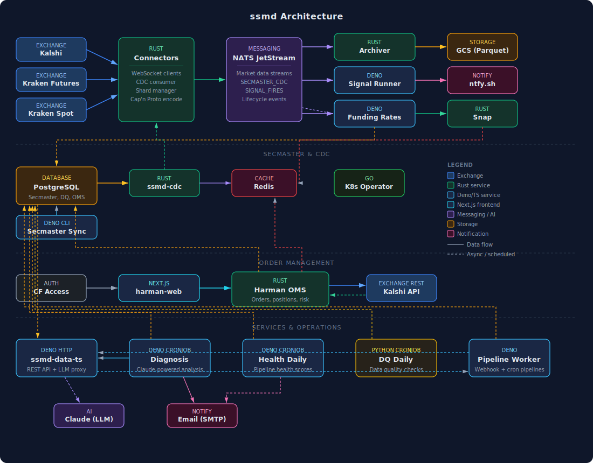

# ssmd - Stupid Simple Market Data

A homelab-friendly market data system. Capture, archive, and analyze market data with GitOps configuration and AI-powered signal development.

## Vision

- **Simple enough for homelab** - No enterprise infrastructure required
- **Simple enough for a TUI** - Minimal operational complexity
- **Simple enough for Claude** - Easy to define new skills and integrations
- **Cloud-first** - Kubernetes-native, GitOps-driven
- **Quality data platform** - Provenance tracking, versioned schemas, gap detection

## Architecture



<!-- Source: docs/architecture.d2 - regenerate with: d2 docs/architecture.d2 docs/architecture.svg -->

### Agent


<!-- Source: docs/agent.d2 - regenerate with: d2 docs/agent.d2 docs/agent.svg -->

### Signal Runtime


<!-- Source: docs/signal-runtime.d2 - regenerate with: d2 docs/signal-runtime.d2 docs/signal-runtime.svg -->

## Components

| Component | Language | Purpose |
|-----------|----------|---------|
| **ssmd** | Deno/TypeScript | CLI for metadata, syncs, and backtesting |
| **ssmd-connector** | Rust | WebSocket → NATS publisher |
| **ssmd-archiver** | Rust | NATS → JSONL.gz files |
| **ssmd-data-ts** | Deno/TypeScript | HTTP API for archived data |
| **ssmd-agent** | Deno/TypeScript | LangGraph REPL for signal development |

## Quick Start

```bash
# Prerequisites
sudo apt-get install -y capnproto
curl --proto '=https' --tlsv1.2 -sSf https://sh.rustup.rs | sh -s -- -y
# Deno 2.x required for TypeScript components

# Build and test everything
make all
```

## CLI Usage

The `ssmd` CLI is built with Deno. Run from the `ssmd-agent/` directory:

```bash
cd ssmd-agent

# Show help
deno task cli --help

# Or run directly
deno run -A src/cli/main.ts --help
```

### Commands

#### Feed Management
```bash
# List configured feeds
deno task cli feed list

# Show feed details
deno task cli feed show kalshi

# Create a new feed
deno task cli feed add polymarket --type websocket --endpoint wss://...
```

#### Security Master (Kalshi)
```bash
# Sync events and markets from Kalshi API
deno task cli secmaster sync

# Sync only events
deno task cli secmaster sync --events-only

# Sync only markets
deno task cli secmaster sync --markets-only

# Dry run (fetch but don't write)
deno task cli secmaster sync --dry-run
```

#### Fee Schedules (Kalshi)
```bash
# Sync fee schedules from Kalshi API
deno task cli fees sync

# Show fee statistics
deno task cli fees stats

# List current fee schedules
deno task cli fees list
deno task cli fees list --limit 100
```

#### Backtesting
```bash
# Run a backtest
deno task cli backtest run my-signal --dates 2025-01-01,2025-01-02
deno task cli backtest run my-signal --from 2025-01-01 --to 2025-01-31

# Check status
deno task cli backtest status <run-id>

# Get results
deno task cli backtest results <run-id>

# List recent runs
deno task cli backtest list
```

#### Signal Runtime
```bash
# List available signals
deno task cli signal list

# Run signal against NATS stream (real-time)
deno task cli signal run volume-1m-30min

# Run with console output (no NATS publish)
deno task cli signal run volume-1m-30min --console

# Run against local file data
deno task cli signal run volume-1m-30min --source file --dates 2025-12-29 --data data

# Subscribe to signal fire stream
deno task cli signal subscribe volume-1m-30min
```

#### Agent REPL
```bash
# Start the interactive agent
deno task cli agent

# Or run directly
deno task agent
```

### Environment Variables

| Variable | Description |
|----------|-------------|
| `DATABASE_URL` | PostgreSQL connection string |
| `KALSHI_API_KEY` | Kalshi API key for secmaster/fees sync |
| `ANTHROPIC_API_KEY` | For agent REPL |
| `SSMD_API_URL` | HTTP API endpoint (default: http://localhost:8080) |
| `SSMD_DATA_API_KEY` | API key for ssmd-data-ts |
| `NATS_URL` | NATS server URL (default: nats://localhost:4222) |

## Documentation

| Document | Purpose |
|----------|---------|
| [CLAUDE.md](CLAUDE.md) | Build commands and development guide |
| [DEPLOYMENT.md](DEPLOYMENT.md) | Kubernetes deployment |
| [AGENT.md](AGENT.md) | Signal development with ssmd-agent |
| [TODO.md](TODO.md) | Task tracking and roadmap |
| [docs/designs/](docs/designs/) | Architecture and design documents |
| [docs/plans/](docs/plans/) | Implementation plans |
| [docs/reference/](docs/reference/) | CLI reference, file formats |

## Key Design Decisions

| Decision | Choice | Rationale |
|----------|--------|-----------|
| Deno/TypeScript for CLI | `ssmd` | Code sharing with agent, native TS |
| Rust for hot path | Connector, archiver | Zero-cost abstractions |
| NATS JetStream | Transport | Persistence, replay, simple ops |
| GitOps | Config | Versioned, reviewable, auditable |
| JSONL.gz | Archive | Grep-friendly, compressed |
| Deno + LangGraph | Agent | Native TS, stateful tools |

## Current Status

See [TODO.md](TODO.md) for detailed status. Summary:

- **Phase 1** (GitOps Metadata): Complete
- **Phase 2** (NATS Streaming): Complete
- **Phase 3** (Agent Pipeline): Complete
- **Phase 4** (Signal Runtime): Complete
- **Phase 5+** (Gateway, Trading Day): Planned

## License

MIT
