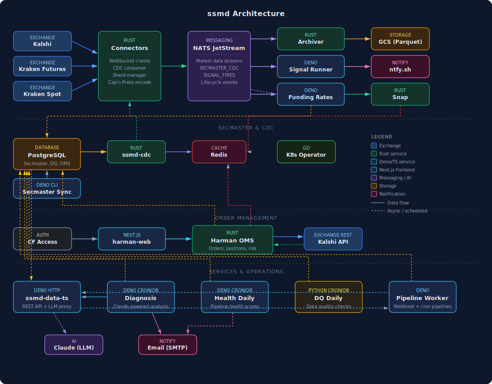

# ssmd - Vibing Market Data

Market data capture, archival, signal development, and order management platform. Connects to exchange WebSocket APIs, publishes to NATS JetStream, archives to compressed files, and manages order lifecycle across exchanges.

## Supported Exchanges

| Exchange | Type | Channels |
|----------|------|----------|
| **Kalshi** | Prediction markets | ticker, trade, market_lifecycle_v2, orderbook_delta |
| **Kraken** (spot) | Crypto spot | ticker, trade |
| **Kraken** (futures) | Crypto perpetuals | ticker, trade |
| **Polymarket** | Prediction markets (CLOB) | last_trade_price, price_change, book, best_bid_ask, new_market, market_resolved |

## Architecture



**Data flows:**
- **Market data**: Exchange WS → Connector → NATS → Archiver + Signal Runner + Consumers
- **Secmaster**: Exchange REST APIs → CLI → PostgreSQL → CDC → NATS
- **CDC**: PostgreSQL → ssmd-cdc → NATS → Connector (dynamic subs) + ssmd-cache (Redis)
- **Snap**: NATS → ssmd-snap → Redis (latest ticker per instrument, 5-min TTL)
- **Funding rates**: NATS → Funding Rate Consumer → pair_snapshots (PostgreSQL)
- **Signals**: Signal Runner → NATS (SIGNAL_FIRES) → Notifier → ntfy.sh
- **Archives**: Archiver → local PVC → GCS sync (Temporal scheduled)
- **Diagnosis**: PostgreSQL (scores) + data-ts (freshness/volume) → Claude → Email
- **Pipelines**: Webhook/cron trigger → data-ts → Pipeline Worker → stages (sql, http, openrouter, email)
- **Order management**: harman-web → Harman OMS → Exchange REST API (order submit/cancel/amend)
- **Reconciliation**: Harman polls exchange positions/fills, compares to local DB, imports unsolicited orders

## Components

### Rust (`ssmd-rust/`)

| Crate | Purpose |
|-------|---------|
| `ssmd-connector` | WebSocket → NATS publisher (multi-exchange) |
| `ssmd-archiver` | NATS → JSONL.gz file archiver (multi-stream) |
| `ssmd-cdc` | PostgreSQL logical replication → NATS |
| `ssmd-cache` | CDC stream → Redis market hierarchy cache |
| `ssmd-snap` | NATS → Redis ticker price cache (5-min TTL) |
| `ssmd-parquet-gen` | JSONL.gz → Parquet conversion (CronJob) |
| `ssmd-schemas` | Parquet Arrow schema definitions |
| `ssmd-exchange-kalshi` | Kalshi REST API client |
| `ssmd-harman` | Order gateway binary (Axum HTTP server) |
| `ssmd-harman-ems` | Execution management (pump, risk, queue) |
| `ssmd-harman-oms` | Order management (reconciliation, recovery, groups, positions) |
| `ssmd-harman-tui` | Terminal UI for order management |
| `harman` | Shared OMS types, DB, state machine |
| `harman-test-exchange` | Kalshi-protocol mock exchange for testing |
| `ssmd-signal-runner` | Signal evaluation against NATS streams (standalone binary) |
| `middleware` | Transport, storage, and cache abstractions |
| `connector` (lib) | Exchange-specific WebSocket clients, writers, CDC consumer, shard manager |
| `schema` | Cap'n Proto message definitions |
| `metadata` | Feed and environment configuration |

### Deno/TypeScript (`ssmd-agent/`)

| Component | Path | Purpose |
|-----------|------|---------|
| CLI | `src/cli/` | Secmaster sync, data quality, scaling, fees, deployment |
| HTTP API | `src/server/` | REST API for market data and secmaster |
| Signal Runner | `src/runtime/` | Real-time signal evaluation daemon |
| Notifier | `src/cli/commands/notifier.ts` | Signal fire → ntfy.sh notification routing (standalone deploy as ssmd-notifier) |
| Momentum | `src/momentum/` | Paper trading momentum engine + backtesting |
| Agent | `src/agent/` | LangGraph REPL with market data tools |
| Pipeline Worker | `src/cli/commands/pipeline-worker.ts` | Poll pipeline_runs, execute typed stages (sql, http, openrouter, email) |
| Funding Rate Consumer | `src/cli/commands/funding-rate-consumer.ts` | NATS → pair_snapshots (Kraken Futures) |
| State Builders | `src/state/` | Orderbook, price history, volume profile |
| Shared Lib | `src/lib/` | DB (Drizzle), API clients, types (Zod), pricing, auth |

### Python (`ssmd-mcp/`)

| Component | Path | Purpose |
|-----------|------|---------|
| MCP Server | `ssmd-mcp/` | Model Context Protocol server for Claude Code/Desktop/Cursor integration |

### Harman OMS (`ssmd-rust/crates/ssmd-harman*`, `harman*`)

Order management system for placing, tracking, and reconciling orders across exchanges.

**Architecture:** 4-crate layered design — `ssmd-harman` (binary) → `ssmd-harman-oms` (order management) → `ssmd-harman-ems` (execution management) → `harman` (shared types, DB, state machine).

**Key features:**
- **Stable sessions** — permanent identity per (exchange, environment, API key), survives pod restarts
- **Per-session risk limits** — configurable max order size, position limits, rate limits
- **Bracket/OCO groups** — linked order groups with automatic cancel-on-fill
- **Fill integrity** — unsolicited orders and fills from the exchange are always imported
- **Exchange adapter pattern** — Kalshi first via `ssmd-exchange-kalshi`, extensible to other exchanges

**Auth:** 4-path priority — CF Access JWT → Bearer token (data-ts validated) → static write token → static admin token. WebSocket event mode for real-time order/fill updates on supported exchanges.

**Deployment:** K8s operator CRD (`harmans.ssmd.ssmd.io`) manages one deployment + service per Harman instance.

### harman-web (Next.js)

Web frontend for Harman OMS. Provides instance picker, order entry, position viewer, and session management with API proxy to Harman instances. Protected by Cloudflare Access.

### Go (`ssmd-operators/`)

Kubernetes operator with CRDs for all ssmd workloads:

| CRD | Purpose |
|-----|---------|
| `connectors.ssmd.ssmd.io` | WebSocket connector pods |
| `archivers.ssmd.ssmd.io` | NATS → JSONL.gz archiver pods |
| `signals.ssmd.ssmd.io` | Signal evaluation pods |
| `notifiers.ssmd.ssmd.io` | Alert notification pods |
| `snaps.ssmd.ssmd.io` | NATS → Redis snap service pods |
| `harmans.ssmd.ssmd.io` | Order gateway deployments + services |

## Connector Modules

Each exchange has its own module in `ssmd-rust/crates/connector/src/`:

| Module | Protocol | Endpoint |
|--------|----------|----------|
| `kalshi/` | Kalshi WS | `wss://api.kalshi.com/trade-api/ws/v2` |
| `kraken/` | Kraken WS v2 | `wss://ws.kraken.com/v2` |
| `kraken_futures/` | Kraken Futures WS v1 | `wss://futures.kraken.com/ws/v1` |
| `polymarket/` | Polymarket CLOB WS | `wss://ws-subscriptions-clob.polymarket.com/ws/market` |

Common module structure: `mod.rs`, `messages.rs`, `websocket.rs`, `connector.rs`, `writer.rs`.

Exchange-specific extras:
- **Kalshi**: `auth.rs`, `cdc_consumer.rs`, `config.rs`, `shard_manager.rs` (CDC-driven dynamic subscriptions, sharding)
- **Polymarket**: `market_discovery.rs` (Gamma REST API discovery, secmaster-driven filtering)

Shared infrastructure in `connector/src/`: `nats_writer.rs`, `publisher.rs`, `metrics.rs`, `flusher.rs`, `ring_buffer.rs`, `secmaster.rs`.

## Building

```bash
# Prerequisites: capnproto, rust, deno 2.x
make setup

# Full validation (lint + security + test + build)
make all

# Rust only
make rust-all       # clippy + test + build
make rust-build     # build only
make rust-test      # test only

# TypeScript only
make agent-test     # run tests
make cli-check      # type check CLI
make agent-check    # type check CLI + agent
```

## NATS Subject Convention

```
{subject_prefix}.json.{type}.{ticker}
```

Where `subject_prefix` is typically `{env}.{feed}` or `{env}.{feed}.{category}` for sharded connectors.

Examples:
- `prod.kalshi.economics.json.trade.KXBTCD-26FEB07-T98000`
- `prod.kalshi.crypto.json.ticker.KXBTCD-26FEB07-T98000`
- `prod.kraken.json.ticker.XXBTZUSD`
- `prod.kraken-futures.json.trade.PF_XBTUSD`
- `prod.polymarket.json.last_trade_price.{condition_id}`

Message types vary by exchange:
- **Kalshi**: `ticker`, `trade`, `orderbook`, `lifecycle`, `event_lifecycle`
- **Kraken**: `ticker`, `trade`
- **Kraken Futures**: `ticker`, `trade`
- **Polymarket**: `last_trade_price`, `price_change`, `book`, `best_bid_ask`, `new_market`, `market_resolved`

## Agent Integration

Agents interact with ssmd through three interfaces: the HTTP API, LangGraph tools, and the CLI.

### HTTP API (`ssmd-data-ts`)

REST API with API key auth (`X-API-Key` header). Scopes: `secmaster:read`, `datasets:read`, `signals:read`, `signals:write`, `llm:chat`, `admin:read`, `admin:write`.

**Secmaster (all exchanges):**

| Endpoint | Description |
|----------|-------------|
| `GET /v1/events` | Kalshi events (filter: `category`, `status`, `series`, `as_of`) |
| `GET /v1/events/:ticker` | Event detail with markets |
| `GET /v1/markets` | Kalshi markets (filter: `category`, `status`, `series`, `close_within_hours`) |
| `GET /v1/markets/:ticker` | Market detail (prices, volume, open interest) |
| `GET /v1/secmaster/stats` | Unified stats across all exchanges |
| `GET /v1/secmaster/markets/timeseries` | Market activity timeseries (added/closed per day) |
| `GET /v1/secmaster/markets/active-by-category` | Active markets by category over time |
| `GET /v1/series` | Kalshi series (filter: `category`, `tag`, `games_only`) |
| `GET /v1/series/stats` | Series statistics |
| `GET /v1/pairs` | Kraken pairs (filter: `exchange`, `market_type`, `base`, `quote`) |
| `GET /v1/pairs/:pairId` | Pair detail (funding rate, mark price for perps) |
| `GET /v1/pairs/:pairId/snapshots` | Funding rate / price time series |
| `GET /v1/pairs/stats` | Pair statistics |
| `GET /v1/conditions` | Polymarket conditions (filter: `category`, `status`) |
| `GET /v1/conditions/:conditionId` | Condition with Yes/No tokens and prices |
| `GET /v1/polymarket/tokens` | Token IDs for connector subscriptions (filter: `category`, `minVolume`, `q`) |
| `GET /v1/fees` | All current fee schedules |
| `GET /v1/fees/:series` | Fee schedule for a Kalshi series |
| `GET /v1/fees/stats` | Fee statistics |

**Data & operations:**

| Endpoint | Description |
|----------|-------------|
| `GET /v1/markets/lookup` | Look up markets by ID across exchanges |
| `GET /datasets` | Archived datasets by feed/date |
| `GET /version` | API version |
| `GET /health` | Health check (no auth) |
| `GET /metrics` | Prometheus metrics (no auth) |
| `POST /v1/chat/completions` | OpenRouter LLM proxy with guardrails |

**Admin (requires `admin:read` or `admin:write`):**

| Endpoint | Description |
|----------|-------------|
| `POST /v1/keys` | Create API key |
| `GET /v1/keys` | List API keys |
| `PATCH /v1/keys/:prefix` | Update API key scopes |
| `DELETE /v1/keys/:prefix` | Revoke API key |
| `GET /v1/keys/usage` | Rate limit and token usage |
| `GET /v1/settings` | Get all settings |
| `PUT /v1/settings/:key` | Upsert setting |

**Harman OMS (requires `admin` scope):**

| Endpoint | Description |
|----------|-------------|
| `GET /v1/harman/sessions` | List all OMS sessions with risk/status summary |
| `GET /v1/harman/sessions/:id/orders` | Query orders for a session |
| `GET /v1/harman/sessions/:id/fills` | Query fills for a session |
| `GET /v1/harman/orders/:id/timeline` | Full order lifecycle timeline |
| `GET /v1/harman/sessions/:id/audit` | Exchange audit log |
| `GET /v1/harman/sessions/:id/settlements` | Query settlements for a session |
| `GET /v1/auth/validate` | Validate API key and return scopes |

### LangGraph Agent Tools

The agent REPL (`ssmd-agent/src/agent/`) provides LangGraph tools that wrap the API:

| Tool | Description |
|------|-------------|
| `list_markets` | Query Kalshi markets with point-in-time support |
| `get_market` | Get market by ticker |
| `list_events` / `get_event` | Kalshi events |
| `list_series` / `get_series` | Kalshi series |
| `list_pairs` / `get_pair` | Kraken trading pairs |
| `get_pair_snapshots` | Funding rate time series |
| `list_conditions` / `get_condition` | Polymarket conditions |
| `get_secmaster_stats` | Cross-exchange stats |
| `get_fee_schedule` / `get_fees` | Fee lookup by series or tier |
| `list_datasets` / `sample_data` / `list_tickers` | Browse archived data |
| `get_schema` | Get schema for a message type |
| `orderbook_builder` / `price_history_builder` / `volume_profile_builder` | State builders for signal development |
| `list_builders` | List available state builders |
| `run_backtest` / `deploy_signal` | Signal evaluation and deployment |
| `get_today` | Current UTC date |

### CLI (`ssmd`)

| Command | Purpose |
|---------|---------|
| `secmaster sync/list/show/stats` | Kalshi secmaster sync and queries |
| `kraken` | Kraken spot + perpetuals sync |
| `polymarket` | Polymarket conditions sync |
| `fees sync/list/stats` | Fee schedule management |
| `series` | Series metadata operations |
| `health daily` | Pipeline health checks and email report |
| `diagnosis analyze` | AI-powered health/DQ analysis via Claude |
| `dq daily/trades` | Data quality scoring and trade checks |
| `keys create/list/update/revoke` | API key management |
| `share` | Generate signed URLs for parquet data sharing |
| `audit-email` | Daily data access audit report email |
| `scale down/up/status` | Cluster scaling for maintenance |
| `schedule list/describe` | Temporal schedule management |
| `archiver sync/deploy/list/status/logs/delete` | Archiver management |
| `connector deploy/list/status/logs/delete` | Connector CR management |
| `signal deploy/list/status/logs/delete` | Signal CR management |
| `notifier deploy/list/status/logs/delete` | Notifier CR management |
| `momentum run/backtest` | Momentum paper trading + backtesting |
| `funding-rate-consumer` | Kraken Futures funding rate NATS consumer |
| `status` | Cluster-wide status overview |
| `env` | Environment context management |
| `feed` | Feed configuration management |
| `init` | Initialize exchanges directory |
| `agent` | Start interactive LangGraph REPL |

## Documentation

| Doc | Purpose |
|-----|---------|
| [CLAUDE.md](CLAUDE.md) | Build commands, detailed architecture, latency design |
| [AGENT.md](AGENT.md) | Signal development agent |
| [Researcher Quickstart](docs/researcher-quickstart.md) | API access, MCP setup, data download |

### Data Schemas

Detailed field-level documentation for all exchange WebSocket messages and parquet output formats:

| Doc | Purpose |
|-----|---------|
| [Kalshi JSON Schema](docs/schemas/kalshi-json.md) | Ticker, trade, lifecycle WS messages — field definitions, sequence numbers, price units |
| [Kraken Futures JSON Schema](docs/schemas/kraken-futures-json.md) | V1 flat format, ticker/trade fields, funding rates, seq numbering |
| [Polymarket JSON Schema](docs/schemas/polymarket-json.md) | CLOB WS messages, condition/token identifier model, array fan-out |
| [Parquet Schemas](docs/schemas/parquet-schemas.md) | All 11 Arrow schemas, JSON→parquet column mapping, type conversions, versioning |

## License

MIT
